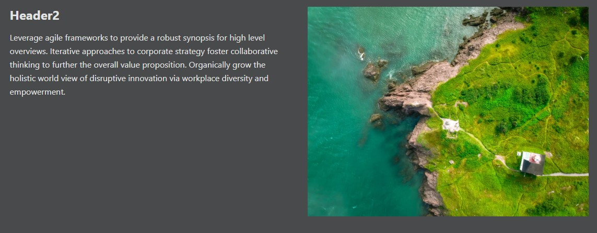
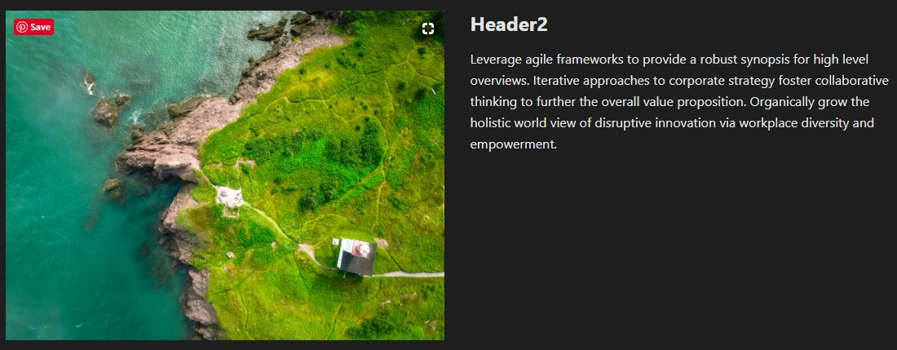

<h1>Components</h1>
<p>Copy and paste the URL into an `index.js` file. Let's say you copied the
`SectionRightImage` and renamed it to `News`. You would call the component in 
between `<main>` with the syntax: `<News />`.


<h2>Section Right Image </h2>


```javascript
function SectionRightImage() {
  return(
    <section class="">
      <div class="row">
        <div class="col col--6">
          <h2 class="">Header2</h2>
          <p>Leverage agile frameworks to provide a robust synopsis for high 
            level overviews.</p>
        </div>
        <div class="col col--6">
          
        </div>
      </div>
    </section>
  )
}
```

<h2>Section Left Image </h2>


```javascript
function SectionLeftImage() {
  return(
    <section class="">
      <div class="row">
        <div class="col col--6">
          
        </div>
        <div class="col col--6">
          <h2 class="">Header2</h2>
          <p>Leverage agile frameworks to provide a robust synopsis for high 
            level overviews.</p>
        </div>
      </div>
    </section>
  )
}
```